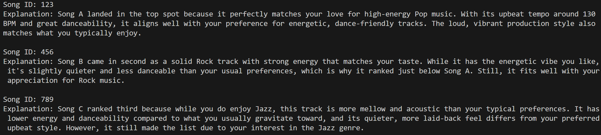
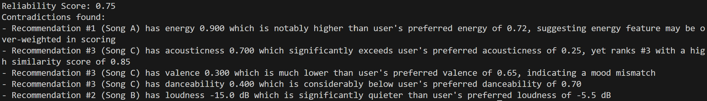
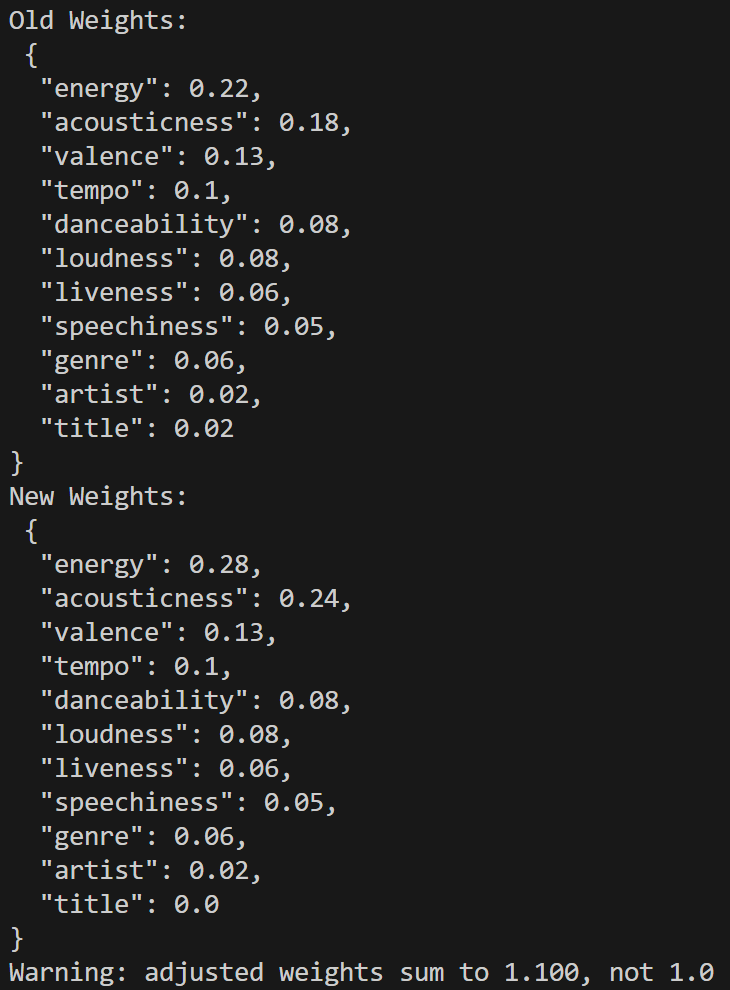

# AuraTrack — Applied AI Music Recommender

## Original Project

The original project was the Music Recommender Simulation. Its goal was to simulate a music recommender that an app
like Spotify may use, using help from AI's capabilities to learn the structure of such system. We were tasked to create
a numerical method to find similar songs to a user's profile and recommend top k songs.

## Title and Summary

My project adds to this system but introducing more data (550k songs), Claude API capabilities, and clustering methods for candidate generation in order to create an applied AI system.

## Architecture Overview

AuraTrack is built as a two-stage retrieval and ranking pipeline that mirrors how production recommender systems work at scale.

**Stage 1 — Candidate Generation (GMM)**
When a user profile is created, their preferences (energy, acousticness, valence, tempo, danceability, loudness, liveness, speechiness) are fed into a pre-trained Gaussian Mixture Model. The GMM converts the profile into a cluster probability vector, which is compared against 550k+ songs using cosine similarity. The top 100 candidate songs are returned for detailed scoring.

**Stage 2 — Weighted Similarity Scoring**
Each candidate song is scored against the user profile using a weighted similarity formula across 11 features. Numerical features use direct subtraction, tempo and loudness are normalized over their respective ranges, and genre uses a fuzzy similarity matrix. The top-k songs are returned as recommendations.

**Self-Critique and Adaptive Weights**
After ranking, an LLM evaluates whether the recommendations make logical sense given the user profile. If the reliability score falls below 0.70, a second LLM call suggests personalized weight adjustments. This means each user's scoring formula adapts over time rather than using global fixed weights.

## Setup Instructions

### Prerequisites
- Python 3.10+
- A virtual environment (recommended)
- Anthropic API key (get one at [console.anthropic.com](https://console.anthropic.com))

### Download Data
- Go to [Spotify Dataset](https://www.kaggle.com/datasets/serkantysz/550k-spotify-songs-audio-lyrics-and-genres?select=songs.csv)
- Download Data 

### Installation

1. Clone the repository:
```bash
git clone <your-repo-url>
cd applied-ai-system-project
```

2. Create and activate a virtual environment:
```bash
python -m venv finalproj
# Windows
finalproj\Scripts\activate
# Mac/Linux
source finalproj/bin/activate
```

3. Install dependencies:
```bash
pip install -r requirements.txt
```

4. Set up your environment variables — create a file at `src/env/.env`:

### Running the App
```bash
cd src
streamlit run app.py
```

### Running Tests
```bash
cd src
pytest test_recommender.py -v
```

## Sample Interactions

### Example 1 - Explanation Generation


### Example 2 - Reliability Scores plus Contradiction Generation


### Example 3 - New Weights Generation


## Design Decisions

Data is important so I wanted to add more data from a Spotify Kaggle dataset. Additionally, I clustered
songs together using a Gaussian Mixture, which uses the idea of expectation maximization, which is like a soft
K-means clustering. This worked better than hard clustering because music songs don't fit neatly into 
discrete categories. A song can be partly Jazz and partly Classical, or blend Electronic and Pop 
characteristics. GMM captures this ambiguity by assigning each song a probability distribution across all 
clusters rather than forcing it into a single one. I used the cosine similarity to compare the clustering with a
user profile with all 550k+ songs to reduce the number of candidates to around 100-300 then found the weighted similarity scores within these candidates. The weights are adpative in which if recommendations aren't good enough, the Claude agent is able to adjust the weights to what the user's profile. Adaptive weights plus weighted similarity is better since different users care about different features more like a user can think mood is more important and another may think the genre is. 

## Testing Summary

I did tests in userprofile initialization, check_ranked_recommendations, get_explanations, score_song, recommend_songs pipeline, EMA updates (like and skip), and weight validation. The logic of each method worked well. I also tested the responses of each LLM call, which were initializing the user profile, giving reliability scores and contradictions in the recommendations, changing the weights if reliability score not good enough, and generating explanations. They mainly worked well, but the weight changes sometimes didn't add up to 1, which could make the scoring ineffective. I learned here that even if you ask for certain restrictions and guidelines, the AI isn't going to be 100% accurate.

## Reflection

**What are the limitations or biases in your system?**

My system largely depends on the data it is given. If new songs, artists, and genres are given, it wouldn't be able to work as well. 

**Could your AI be misused, and how would you prevent that?**

It could not because the AI is used within the system and any users are not using the AI directly. The only way they can affect it by feeding it false likes and skips to depict a user profile that doesn't represent the user. Can't really prevent that because that is the profile the user wants and will get.

**What surprised you while testing your AI's reliability?**

Some of the math wasn't perfect like adding up the weights. I told it specifically to have the weights add up to one, but it sometimes didn't do that. I was close to not including that "add up to 1" check because of my confidence in the AI doing it correctly, but glad I did, since it wasn't perfect.

**Describe your collaboration with AI during this project. Identify one instance when the AI gave a helpful suggestion and one instance where its suggestion was flawed or incorrect.**

It helped visualize and complete my vision for the project. I wanted to use more data and cluster them together and use agents to help update weights and user profiles, but didn't know how to get started. The AI helped set my ideas up, so I can add to it. The times it was incorrect is when it tried to do too much or didn't have the full context. So, I had to understand that and just get the general ideas, and apply it to my context.

## Presentation
[Loom Presentation](https://www.loom.com/share/dd32baeba0a04ba98337c5a7a32442c1)
